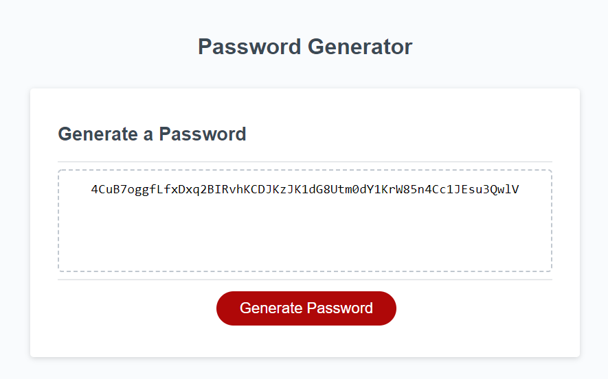

# password-generator

Link to the Deployed URL: https://lewischatham.github.io/password-generator/
Link to the Github repository: https://github.com/LewisChatham/password-generator

## Description

This project is a password generator that takes specific criteria and turns them into a password. 
- Length
- Lowercase
- Uppercase
- Numeric
- Sepcial

It creates randomized passwords that are very secure and impossible to guess.

I learnt a lot about recursion and randomising in a loop.

## Usage

To use the application, you start by pressing the "generate password" button in the middle of the screen.

This then asks for the criteria of the password while keeping your password secure. (making sure certain criteria are met)

The password will be displayed in the text box above the button.

   

## License
MIT License

Copyright (c) [year] [fullname]

Permission is hereby granted, free of charge, to any person obtaining a copy
of this software and associated documentation files (the "Software"), to deal
in the Software without restriction, including without limitation the rights
to use, copy, modify, merge, publish, distribute, sublicense, and/or sell
copies of the Software, and to permit persons to whom the Software is
furnished to do so, subject to the following conditions:

The above copyright notice and this permission notice shall be included in all
copies or substantial portions of the Software.

THE SOFTWARE IS PROVIDED "AS IS", WITHOUT WARRANTY OF ANY KIND, EXPRESS OR
IMPLIED, INCLUDING BUT NOT LIMITED TO THE WARRANTIES OF MERCHANTABILITY,
FITNESS FOR A PARTICULAR PURPOSE AND NONINFRINGEMENT. IN NO EVENT SHALL THE
AUTHORS OR COPYRIGHT HOLDERS BE LIABLE FOR ANY CLAIM, DAMAGES OR OTHER
LIABILITY, WHETHER IN AN ACTION OF CONTRACT, TORT OR OTHERWISE, ARISING FROM,
OUT OF OR IN CONNECTION WITH THE SOFTWARE OR THE USE OR OTHER DEALINGS IN THE
SOFTWARE.
